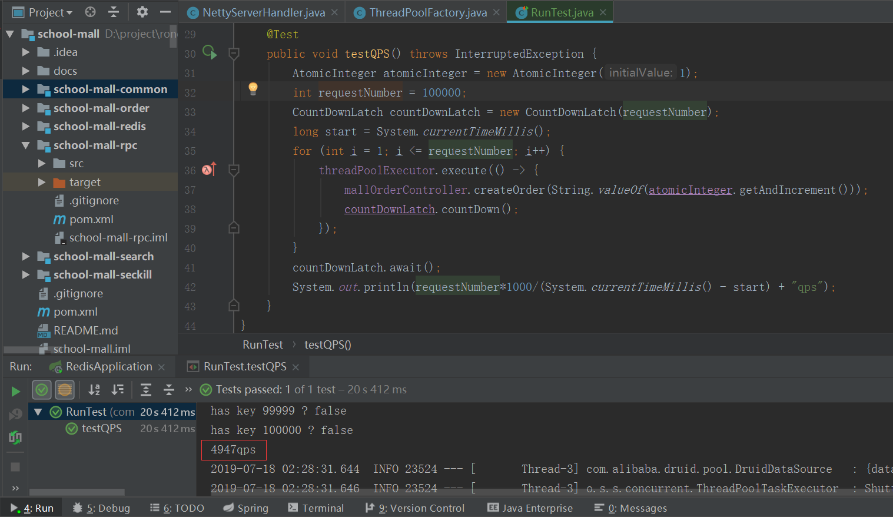
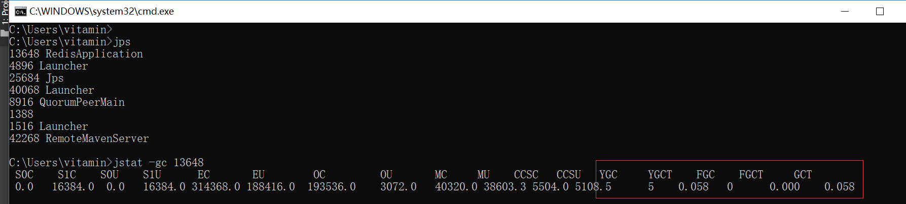
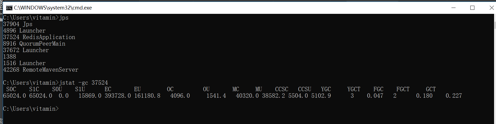
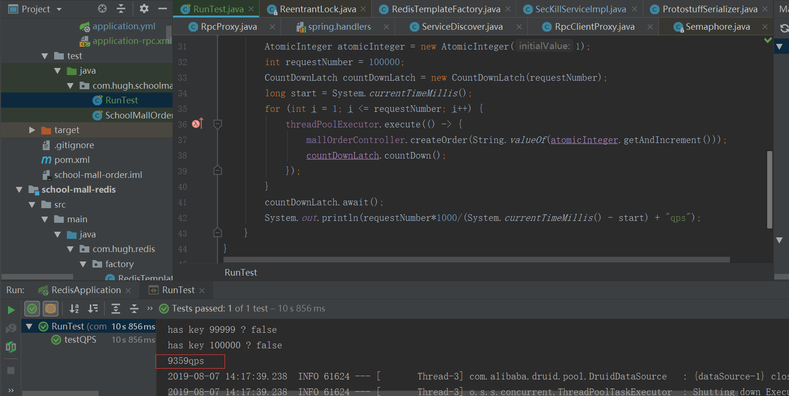
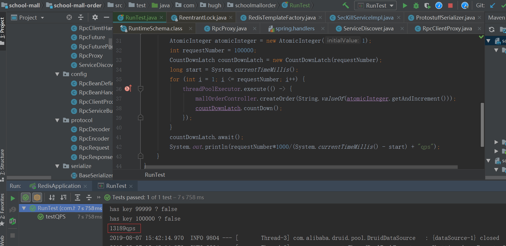

* [一、前言](#前言)
* [二、分布式锁](#分布式锁)
    * [Redis分布式锁](##1.Redis分布式锁)
    * [ZooKeeper分布式锁](##2.ZooKeeper分布式锁)
* [三、RPC](#RPC)
    * [工作流程](#1.RPC工作流程)
    * [序列化](#2.序列化与反序列化)
    * [编码解码](#3.编码与解码)
    * [配置](#4.客户端xml配置)
    * [性能压测](#1-性能压测)
    * [优化](##优化)
* [四、Lucene](#Lucene)
    * [核心思想](#核心思想(原理))


# 前言
该秒杀项目主要是对书本上的知识进行实践，以达到加深巩固的作用。
- 主要涉及到的基础知识有 并发(最主要)、反射、JDK动态代理、设计模式等。<br>
- Spring IOC 和 AOP的运用<br>
- Redis作为缓存、分布式锁
- Zookeeper实现服务注册中心和分布式锁
- Netty了解不多，实现了同步的RPC，可变异步
- Lucene主要用来检索数据，可替代MySQL的like查询
- 为分布式集群架构，先单机玩着


# 分布式锁
## 1.Redis分布式锁
### 1. SETNX KEY VALUE
SETNX是SET if Not eXists的简写，当该Key不存在时才能保存Value，所以可以利用该命令实现同一个方法在多台服务器上同一时刻只有一条线程可以执行。<br>
即当一个线程成功写入某键值对后，就获得了锁。执行完后可以删除该键或设置过期时间来释放锁<br>
缺点：在保存该键值对后，还没来得及设置过期时间或删除键时，持有该锁的服务器宕机了，会造成死锁

### 2. SET key value [expiration EX seconds| PX milli] [NX|XX]
https://redis.io/commands/set <br>
与SETNX具有相同的功能，不同的是，该命令保存键值对时还可以设置过期时间(原子操作)，即使获取了锁的服务器宕机了，也不会造成死锁<br>

### 3. 个人实现
用Spring Boot提供的redis starter，spring-data-redis-2.1版本依赖提供了带设置过期时间的SETNX来让开发者使用，超级方便。方法代码如下
```java
	/**
	 * Set {@code key} to hold the string {@code value} and expiration {@code timeout} if {@code key} is absent.
	 *
	 * @param key must not be {@literal null}.
	 * @param value must not be {@literal null}.
	 * @param timeout the key expiration timeout.
	 * @param unit must not be {@literal null}.
	 * @return {@literal null} when used in pipeline / transaction.
	 * @since 2.1
	 * @see <a href="http://redis.io/commands/set">Redis Documentation: SET</a>
	 */
	@Nullable
	Boolean setIfAbsent(K key, V value, long timeout, TimeUnit unit);
```

个人实现的获取锁和释放锁代码如下，测试暂无发现超卖现象
```java
    /**
     * 上锁，并设置键的过期时间防止死锁
     * 失败则进行重试
     *
     * @param maxRetries    重试次数
     * @param baseSleepTime 重试间隔时间
     * @param expireTime    键的过期时间
     * @return 是否成功获得锁
     */
    public boolean lock(int maxRetries, int baseSleepTime,
                        long expireTime, TimeUnit timeUnit) {
         /*
          * 参数校验
          */
        if (maxRetries < 0 || baseSleepTime < 0 || expireTime < 0) {
            return false;
        }
        /*
         * 通过RPC调用redis模块进行操作
         */
        boolean isLock = redisService.setIfAbsent(lockKey, "1", expireTime, timeUnit);
        if (isLock) {
            return true;
        } else {
           /*
            * 失败重试，自旋
            */
            while (maxRetries-- > 0) {
                try {
                    Thread.sleep(baseSleepTime);
                } catch (InterruptedException e) {
                    log.error(Thread.currentThread().getName() + "is interrupted", e);
                }
            }
        }
        return false;
    }
```

## 2.ZooKeeper分布式锁
### ZooKeeper的数据模型 
https://zookeeper.apache.org/doc/current/zookeeperProgrammers.html#sc_zkDataModel_znodes<br>
ZooKeeper将所有数据存储在内存中，数据模型是一个树(Znode Tree)。这棵树是由很多个节点(Znode)组成的，每个节点的引用规则就是路径引用。/service/redis表示一个Znode，它包含子节点引用、存储数据、访问权限以及节点元数据等四部分

### Znode的类型
- 持久节点（PERSISTENT）：节点创建后，就一直存在，直到有删除操作来主动清除这个节点
- 持久顺序节点（PERSISTENT_SEQUENTIAL）：保留持久节点的特性，额外的特性是，每个节点会为其第一层子节点维护一个顺序，记录每个子节点创建的先后顺序，ZK会自动为给定节点名加上一个数字后缀（自增的），作为新的节点名。
- 临时节点（EPHEMERAL）：和持久节点不同的是，临时节点的生命周期和客户端会话绑定，当然也可以主动删除。`(RPC服务注册我用的是这个，因为我想在服务节点后创建属于该服务的地址节点)`
- 临时顺序节点（EPHEMERAL_SEQUENTIAL）：保留临时节点的特性，外加顺序特性，参考持久顺序节点(分布式锁用这个)

### 使用临时顺序节点实现分布式锁
当有线程来请求锁时，就在锁的节点下创建一个临时顺序节点，默认获取到最小子节点的线程持有锁，释放锁时删除该节点。那么下一节点便成了最小节点，创建该节点的线程持有锁。<br><br>
为什么要用临时顺序节点？<br>
假如获得线程的服务器宕机了，那么ZooKeeper与该服务器的会话便中断，ZooKeeper会自动删除该线程创建的节点，且最小子节点对应的线程获取锁


# RPC
 ### 1.RPC工作流程
    


RPC通信大致可划分为四个步骤<br>
1. 客户端发起请求：代理服务会封装请求的相关参数( requestID,methodName,ClassName,params等)，获取服务地址，最后将数据序列化后发给服务端
2. 服务端接收请求：接收到请求后，将参数反序列化，服务端会根据className去查找匹配对应的具体服务，并根据参数进行反射获取结果
3. 服务端响应请求：将对应的结果、请求id、消息等封装并序列化传输给客户端
4. 客户端接收响应：将响应的数据反序列化，得到返回结果，返回给调用处，结束

### 2.序列化与反序列化
   JDK原生序列化之后的码流大、性能低，这里用的是protostuff序列化工具，可以看下ProtostuffSerializer那个类，以后闲的话再扩展其他序列化方式
    
### 3.编码与解码
   用Netty进行TCP传输，可能会出现粘包半包的问题，这里通过在消息体前加入了4字节的消息头，声明消息体的长度来解决粘包半包问题。具体实现在RpcEncoder和RpcDecoder
   
### 4.客户端xml配置
```xml
<?xml version="1.0" encoding="UTF-8"?>
<beans xmlns="http://www.springframework.org/schema/beans"
       xmlns:xsi="http://www.w3.org/2001/XMLSchema-instance"
       xmlns:hugh="https://github.com/52123/schema/ch"
       xsi:schemaLocation="http://www.springframework.org/schema/beans
       http://www.springframework.org/schema/beans/spring-beans.xsd
       https://github.com/52123/schema/ch
       https://github.com/52123/schema/ch.xsd">

    <hugh:client id="redisService" serviceInterface="com.hugh.common.rpc.RedisService"
                 serviceName="redis" zooKeeperAddress="127.0.0.1:2181"/>

</beans>
```

### 5. 服务端xml配置
```xml
<?xml version="1.0" encoding="UTF-8"?>
<beans xmlns="http://www.springframework.org/schema/beans"
       xmlns:xsi="http://www.w3.org/2001/XMLSchema-instance"
       xmlns:hugh="https://github.com/52123/schema/ch"
       xsi:schemaLocation="http://www.springframework.org/schema/beans
       http://www.springframework.org/schema/beans/spring-beans.xsd
       https://github.com/52123/schema/ch
       https://github.com/52123/schema/ch.xsd">

    <hugh:server id="redisService" serviceAddress="127.0.0.1"
                 servicePort="8080" serviceName="redis" zooKeeperAddress="127.0.0.1:2181"/>

</beans>
```

## 性能压测

### 1. 性能压测
    配置：4核 8G 
    JVM参数：-XX:+UseG1GC -Xmx512m -Xms512m 
单机10w次请求耗时截图



`10w次请求，大约耗时20s，平均qps在5000左右`

<br><br>

### 2.GC情况
    JVM参数：-XX:+UseG1GC -Xmx512m -Xms512m 


`使用G1收集器，只发生了5次Young GC，GC总耗时为0.058秒`

--------------------------------------
    JVM参数：-Xmx512m -Xms512m 


`默认使用Parallel收集器，发生了3次Young GC和2次Full GC, 总耗时为0.227秒。`

<br><br>

--------------------------------------
## 优化

优化了两点：
- 问题：之前考虑一个服务可能有多个地址(集群)，所以当线程拿到不同的服务地址，需要新建一个RpcClient，而RpcClient又错误地设置成了成员属性，导致多个线程可并发访问，所以加了锁。<br><br>
解决方法：去除了锁，将RpcCLient用ConcurrentHashMap存储，当线程拿到服务地址，则去map中查找，有就直接连接，无就新建。<br><br>
优化结果：QPS提高了一倍


<br><br>
<br><br>

- 小问题：发现每次查找服务时，都需要去访问ZooKeeper，导致大量不必要的网络通信<br><br>
解决方法：用List存储ZooKeeper对应服务的所有地址，后面通过监听ZooKeeper节点的变化再去改变List和对应服务地址的CHM（防止内存泄漏）<br><br>
优化结果：经过这两点的优化，QPS几乎提高了两倍


<br>

` JVM参数都为 -XX:+UseG1GC -Xmx512m -Xms512m `


# Lucene
概述：Lucene是一个高效的，基于Java的全文检索库，只需导入相关Jar包即可使用。数据存储于硬盘，是二进制文本，不能直接打开<br>
### 核心思想(原理)
对全文数据(非结构化数据)的搜索主要有两种方法：
- 一、顺序扫描法：逐个打开文件查找是否包含某个字符串
- 二、Lucene核心思想--全文检索：先建立倒排索引，再对索引进行搜索<br>

`倒排索引：是一种“ 关键词 --> 文档 ”的一种映射关系结构`

Lucene之所以那么快，就是根据预先生成的倒排索引，通过用户提供的关键词，查找出对应文档，从而大大加快检索速度。