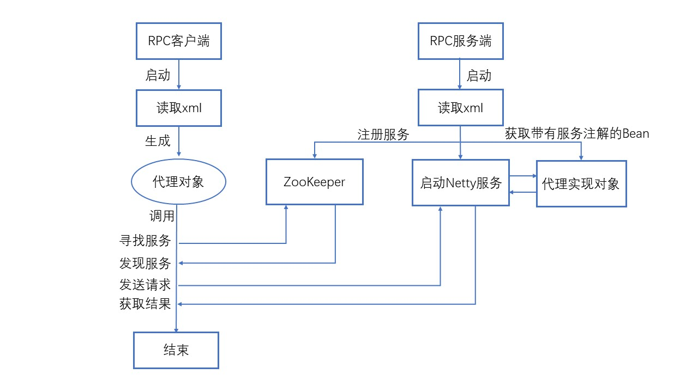

## RPC
 ### 1. RPC工作流程
    


RPC通信大致可划分为四个步骤<br>
1. 客户端发起请求：代理服务会封装请求的相关参数( requestID,methodName,ClassName,params等)，获取服务地址，最后将数据序列化后发给服务端
2. 服务端接收请求：接收到请求后，将参数反序列化，服务端会根据className去查找匹配对应的具体服务，并根据参数进行反射获取结果
3. 服务端响应请求：将对应的结果、请求id、消息等封装并序列化传输给客户端
4. 客户端接收响应：将响应的数据反序列化，得到返回结果，返回给调用处，结束

### 2. 序列化与反序列化
   JDK原生序列化之后的码流大、性能低，这里用的是protostuff序列化工具，可以看下ProtostuffSerializer那个类，以后闲的话再扩展其他序列化方式
    
### 3. 编码与解码
   用Netty进行TCP传输，可能会出现粘包半包的问题，这里通过在消息体前加入了4字节的消息头，声明消息体的长度来解决粘包半包问题。具体实现在RpcEncoder和RpcDecoder
   
### 4. 客户端xml配置
```xml
<?xml version="1.0" encoding="UTF-8"?>
<beans xmlns="http://www.springframework.org/schema/beans"
       xmlns:xsi="http://www.w3.org/2001/XMLSchema-instance"
       xmlns:hugh="https://github.com/52123/schema/ch"
       xsi:schemaLocation="http://www.springframework.org/schema/beans
       http://www.springframework.org/schema/beans/spring-beans.xsd
       https://github.com/52123/schema/ch
       https://github.com/52123/schema/ch.xsd">

    <hugh:client id="redisService" serviceInterface="com.hugh.common.rpc.RedisService"
                 serviceName="redis" zooKeeperAddress="127.0.0.1:2181"/>

</beans>
```

### 5. 服务端xml配置
```xml
<?xml version="1.0" encoding="UTF-8"?>
<beans xmlns="http://www.springframework.org/schema/beans"
       xmlns:xsi="http://www.w3.org/2001/XMLSchema-instance"
       xmlns:hugh="https://github.com/52123/schema/ch"
       xsi:schemaLocation="http://www.springframework.org/schema/beans
       http://www.springframework.org/schema/beans/spring-beans.xsd
       https://github.com/52123/schema/ch
       https://github.com/52123/schema/ch.xsd">

    <hugh:server id="redisService" serviceAddress="127.0.0.1"
                 servicePort="8080" serviceName="redis" zooKeeperAddress="127.0.0.1:2181"/>

</beans>
```